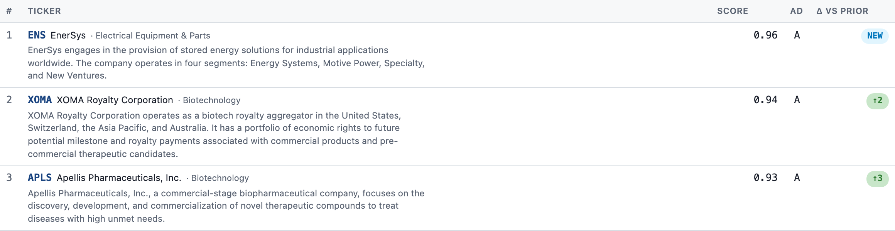

# CANSLIM dashboard

A personal digest page on top of the upstream
[CANSLIM scanner](https://zhoutongchar.github.io/canslim-scanner/). Strips the
reports down to **full-match** tickers only, shows the **top 10**, and surfaces
**day-over-day rank deltas** so movement is visible at a glance.

**🔗 Live dashboard:** https://shuaitang5.github.io/canslim-dashboard/dashboard.html
(auto-refreshes daily at 23:00 UTC via GitHub Actions; mobile-friendly)

Or open the local artifact by double-clicking `dashboard.html`.



---

## What it shows

Two side-by-side panels:

| Panel | What it is | What the delta column means |
|---|---|---|
| **Left — primary date** | The picked day's top 10 full CANSLIM matches, ranked by composite score. | **Δ vs prior**: `NEW` / `=` / `↑N` / `↓N` — movement vs the previous available report. |
| **Right — prior date** | The previous available report's top 10 (for reference). | **Status today**: `held #X` / `↑ to #X` / `↓ to #X` / `DROPPED` — what happened to each ticker today. |

A few details worth knowing:

- Rank deltas use the **full full-match list** rank, not top-10 rank. So a
  ticker moving #12→#7 correctly shows `↑5` instead of `NEW`.
- Each ticker row shows `SYMBOL · Company Name · Industry` plus a 1-2 sentence
  business description from Yahoo Finance.
- Clicking the ticker opens the upstream scanner report jumped to that
  ticker's card (with the SVG chart, CANSLIM gate breakdown, volume action).
- The date dropdown lets you replay any historical day — the right panel
  always shows the day immediately before the picked date.
- Header regime badge (`UPTREND` / `CAUTION` / `DOWN`) and source-report link
  stay synced to the picked date.

---

## How it works

Pipeline is three scripts, each deliberately small:

```
┌──────────────────────────────┐
│ github.io scanner index      │
│  runs/YYYY-MM-DD_HHMMSS/     │
└───────────────┬──────────────┘
                │ discover + fetch each run
                ▼
┌──────────────────────────────┐
│ build_dashboard.py           │  ← parses <section bucket-matches> from each
│  - HTML regex parse          │    report: ticker, score, gates, A/D, regime
│  - writes data.json          │
└───────────────┬──────────────┘
                │ merge with company info
                ▼
┌──────────────────────────────┐
│ enrich_companies.py          │  ← yfinance: longName, industry,
│  - yfinance .info per ticker │    trimmed 1-2 sentence summary
│  - caches companies.json     │    (cache keeps reruns ~free)
└───────────────┬──────────────┘
                │
                ▼
┌──────────────────────────────┐
│ dashboard.html (self-cont.)  │  ← data inlined as JSON; JS renders
│                              │    the two panels + delta badges
└──────────────────────────────┘
```

- **Data source:** the upstream scanner publishes one static HTML run per day
  at `https://zhoutongchar.github.io/canslim-scanner/runs/<date>_<stamp>/`.
  The `canslim` zsh function prints today/yesterday URLs — same source this
  dashboard scrapes automatically.
- **Parsing:** each report embeds full-match candidates as
  `<details class="candidate" data-ticker="…">` nodes inside
  `<section class="bucket bucket-matches">`. A regex pulls ticker / score /
  gates / A/D grade in order — the candidate order *is* the rank.
- **Company blurb:** `yfinance.Ticker(symbol).info` → `longBusinessSummary`
  trimmed to the first 1-2 sentences (max ~320 chars). Cached to
  `companies.json` so reruns only fetch *new* tickers.
- **Rendering:** `dashboard.html` contains the parsed data inlined in a
  `<script id="data" type="application/json">` tag. Everything else is a few
  hundred lines of vanilla JS + CSS. No build tools, no CDN, no server —
  opens cleanly from `file://` and works offline.

---

## How to refresh

The dashboard is a **static snapshot** — it does *not* auto-pull new days.
When the upstream scanner publishes a new report, run:

```bash
cd "/Users/tangshua/Library/CloudStorage/GoogleDrive-louistang0909@gmail.com/My Drive/mynotes/canslim"
./refresh.sh
```

Which runs both steps in order:

```
==> enrich_companies.py   # fetches any NEW tickers (cache hit = skip)
==> build_dashboard.py    # regenerates data.json + dashboard.html
```

Then reload `dashboard.html` in the browser.

**Variants:**

```bash
./refresh.sh --refresh           # force re-fetch every company blurb
python3 build_dashboard.py       # skip enrichment (reuse cached blurbs)
python3 enrich_companies.py      # just update the company cache
python3 verify_dashboard.py      # headless Playwright sanity check
```

---

## Files in this folder

| File | Role |
|---|---|
| `dashboard.html` | **The artifact.** Self-contained static page. Open in browser. |
| `refresh.sh` | One-shot refresh: runs enrichment + rebuild. |
| `build_dashboard.py` | Discovers + parses upstream reports, emits `data.json` and `dashboard.html`. |
| `enrich_companies.py` | yfinance-based company info enrichment, caches to `companies.json`. |
| `verify_dashboard.py` | Headless Playwright test — row counts, ticker order, diff badges, company blurbs, date switching. |
| `data.json` | Parsed data payload (inlined into `dashboard.html`). |
| `companies.json` | Company-info cache — `{ticker: {name, industry, sector, blurb}}`. |
| `_verify.png`, `_verify_closeup.png`, `_verify_left.png` | Verification screenshots. |
| `log.md` | Running ledger of changes. |

---

## Dependencies

One-time setup (already done on this machine):

```bash
pip install --user playwright yfinance
python3 -m playwright install chromium
```

`yfinance` for company blurbs, `playwright` for the optional verifier.
`build_dashboard.py` itself only uses the Python stdlib.

---

## Limitations / things to know

- **Static snapshot.** New upstream reports are not auto-picked up — run
  `./refresh.sh` after the scanner publishes.
- **yfinance rate limits.** Rare, but if the `.info` call starts returning
  empty data, wait a few minutes or use the cached `companies.json`.
- **Only full matches.** "Near match" / buyable / watchlist / basing buckets
  are intentionally dropped — full CANSLIM-gate matches only. Changing this
  is a few lines in `build_dashboard.py` (widen the `MATCHES_SECTION_RE`).
- **Top-10 cap.** Hard-coded as `TOP_N = 10` in the inline JS. Lift it there
  if you ever want a longer list.
- **Timezone.** Dates come straight from the upstream run directory names —
  no timezone parsing, no conversions.
